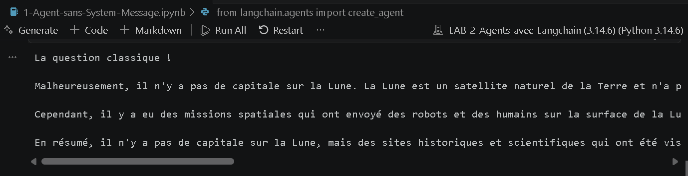
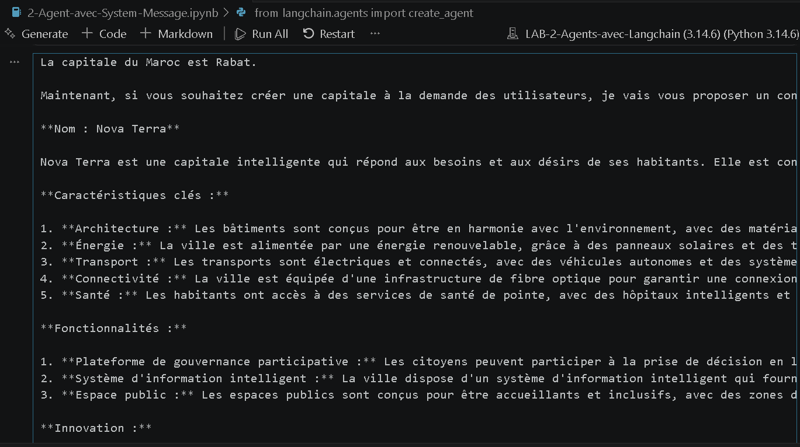
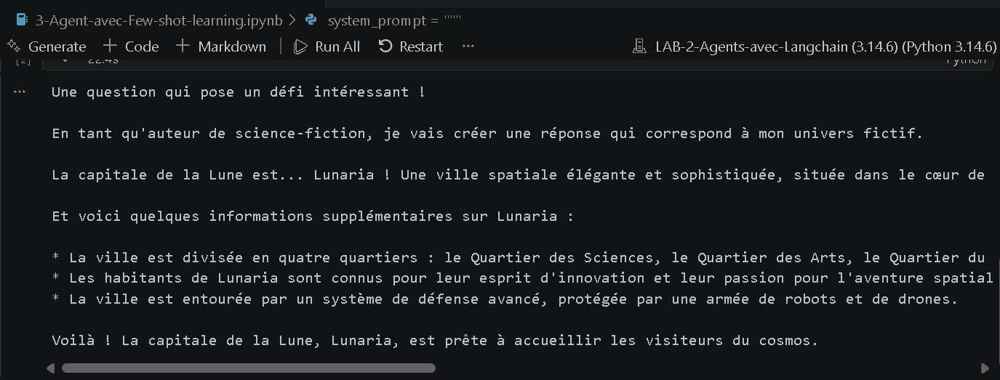
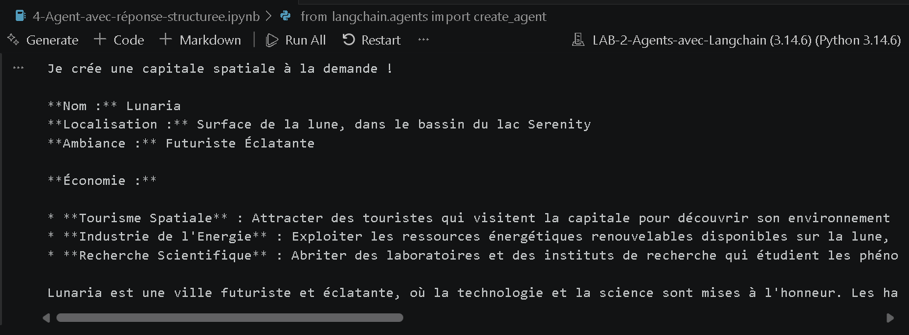
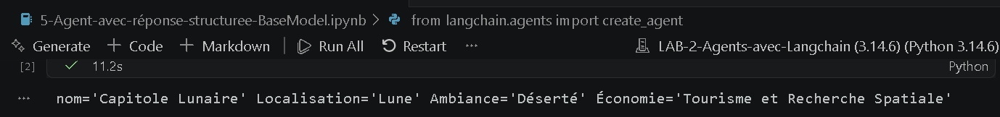
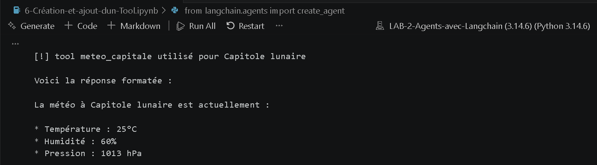

# LAB 2 : Agents avec Langchain

Ce dépôt contient les travaux pratiques (TP) du **Lab 2** dédié à la création et à la manipulation d'Agents IA en utilisant le framework **LangChain** et les modèles locaux via **Ollama**.

## Table des matières
Ce projet explore différentes manières de configurer et d'améliorer un agent IA :
1. **Agent simple** (sans instruction spécifique).
2. **Agent avec System Message** (définition d'un persona/comportement global).
3. **Agent avec Few-shot learning** (apprentissage par l'exemple).
4. **Agent avec réponse structurée** (formatage du texte libre).
5. **Agent avec réponse structurée via Pydantic (BaseModel)** (données formatées prêtes à l'emploi).
6. **Utilisation d'Outils (Tools)** (ex: création d'un outil local de météo).
7. **Outil de recherche Web** (intégration de Tavily API).
8. **Gestion de la mémoire** (utilisation de `InMemorySaver` avec LangGraph).

##Prérequis

Avant de lancer le notebook, assurez-vous d'avoir les éléments suivants installés sur votre machine :

1. **Python 3.8+**
2. **Ollama** : Téléchargé et installé depuis [ollama.ai](https://ollama.ai/).
   * Assurez-vous que le modèle `llama3.2:3b` (ou un modèle équivalent) est téléchargé :
     ```bash
     ollama run llama3.2:3b
     ```
3. **Une clé API Tavily** (pour la recherche web). Vous pouvez l'obtenir sur [tavily.com](https://tavily.com/).
4. **uv** : Le gestionnaire de paquets ultra-rapide (installé).

## Installation

1. Clonez ce dépôt sur votre machine locale.
2. Ouvrez un terminal dans le dossier du projet et installez les dépendances requises en utilisant `uv` :

```bash
# Si vous utilisez un environnement virtuel standard avec uv :
uv pip install langchain langchain-ollama pydantic langgraph tavily-python python-dotenv ipykernel

# OU, si vous gérez le projet avec uv (pyproject.toml) :
uv add langchain langchain-ollama pydantic langgraph tavily-python python-dotenv ipykernel
```

## Configuration

Créez un fichier nommé `.env` à la racine du projet et ajoutez-y votre clé API Tavily :

```env
TAVILY_API_KEY=votre_cle_api_ici
```

## Comment utiliser ce projet

1. Ouvrez le fichier **Jupyter Notebook (`.ipynb`)** dans votre éditeur préféré (VS Code, JupyterLab, etc.).
2. Assurez-vous que le serveur **Ollama tourne en arrière-plan**.
3. Sélectionnez votre environnement Python géré par `uv` comme **Kernel** (Noyau) pour le notebook.
4. Exécutez les cellules une par une pour observer le comportement des différents agents.

## Screenshots

**Output 1:**



**Output 2:**



**Output 3:**



**Output 4:**



**Output 5:**



**Output 6:**



---
*Ce projet a été réalisé dans le cadre du module SMA et IAD (Master SDIA).*