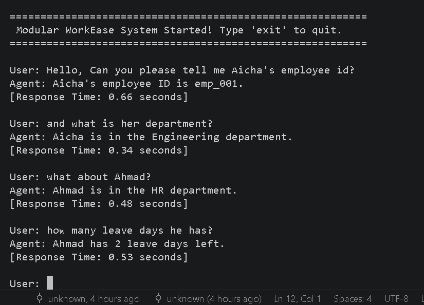

# WorkEase - Agentic RAG HR Assistant

## Description
WorkEase est un système d'assistant RH intelligent développé dans le cadre d'un projet d'évaluation de Master. Il utilise une architecture **Agentic RAG** (Retrieval-Augmented Generation) pour répondre aux questions des employés en s'appuyant à la fois sur des données structurées (base de données employés) et des données non-structurées (politiques de l'entreprise).

## Fonctionnalités Principales
- **Raisonnement Agentique :** Construit avec **LangGraph**, l'agent décide dynamiquement des outils à utiliser pour répondre aux requêtes.
- **RAG Local :** Utilise **ChromaDB** et **HuggingFace Embeddings** pour indexer et rechercher dans les documents de politique interne.
- **Gestion de la Mémoire :** Maintient le contexte de la conversation grâce au `MemorySaver` de LangGraph, permettant des requêtes de suivi fluides.
- **Modèle LLM Performant :** S'appuie sur `Llama-3.3-70b-versatile` via **Groq** pour une inférence ultra-rapide et des appels d'outils précis.

## Structure du Projet
```text
├── main.py                 # Point d'entrée principal du système
├── graph/
│   └── workflow.py         # Définition du graphe d'état et routage (LangGraph)
├── tools/
│   └── hr_tools.py         # Outils d'accès aux données structurées des employés
├── data/
│   └── leave_policy.txt    # Documents bruts pour la base vectorielle (RAG)
├── .env                    # Variables d'environnement (ex: GROQ_API_KEY)
└── README.md
```

## Prérequis et Installation

**Cloner le dépôt :**

```bash
git clone <votre-url-git>
cd Projet-Evaluation
```
**Créer et activer un environnement virtuel :**

```bash
python -m venv .venv
# Windows
.venv\Scripts\activate
# macOS/Linux
source .venv/bin/activate
```
**Installer les dépendances :**

```bash
pip install langgraph langchain-groq chromadb sentence-transformers langchain-community langchain-huggingface langchain-chroma python-dotenv
```
**Configurer l'API Key :**
Créez un fichier .env à la racine du projet et ajoutez votre clé Groq :

```text
GROQ_API_KEY="votre_cle_groq_ici"
```

## Utilisation
Pour lancer l'assistant WorkEase, exécutez simplement :

```bash
python main.py
```

## Démonstration Vidéo
Cliquez sur l'image ci-dessous pour visionner la simulation de 2 minutes du système en action :

[](https://youtu.be/BDF9jIBnEtI)