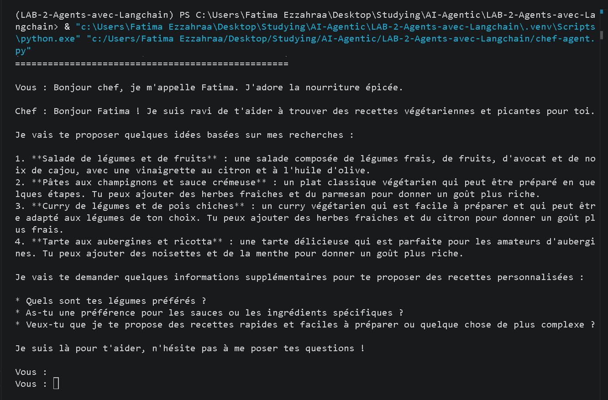

# Agent Chef Personnel

Un chef personnel interactif propulse par l'IA, construit avec **Langchain**, **Ollama**, et **Langgraph**. Cet agent agit comme votre assistant culinaire intelligent : il prend note des ingredients dans votre refrigerateur, memorise vos preferences alimentaires tout au long de la conversation, et effectue des recherches sur le web pour trouver les meilleures recettes et techniques culinaires afin de vous proposer des plats sur mesure.

## Fonctionnalites

* **Chat interactif :** Communiquez avec l'agent de maniere fluide et en langage naturel.
* **Memoire conversationnelle :** Utilise `InMemorySaver` pour se souvenir de vos restrictions alimentaires (ex : vegetarien, allergies) et de vos preferences tout au long de la session.
* **Capacite de recherche Web :** Integre le `TavilyClient` comme outil personnalise, permettant a l'agent de naviguer sur Internet pour trouver des recettes recentes et des associations d'ingredients.
* **Traitement IA local :** S'execute entierement en local via **Ollama** (`llama3.2:3b`), garantissant le respect de votre vie privee et une utilisation gratuite sans cout de tokens.

---

## Prerequis

Avant de lancer le projet, assurez-vous d'avoir installe les elements suivants :

1.  **Python 3.8+** et **uv** installes sur votre machine.
2.  **Ollama :** Telechargez et installez-le depuis [ollama.com](https://ollama.com/).
3.  **Modele Llama 3.2 :** Une fois Ollama installe, ouvrez votre terminal et telechargez le modele requis en executant cette commande :
    ```bash
    ollama run llama3.2:3b
    ```
4.  **Cle API Tavily :** Obtenez une cle API gratuite pour la recherche web sur [Tavily](https://tavily.com/).

---

## Installation et Configuration

**1. Acceder au dossier du projet**
Naviguez vers le dossier contenant votre script :
```bash
cd chemin/vers/votre/projet
```

**2. Creer un environnement virtuel**
Il est fortement recommande d'utiliser un environnement virtuel pour gerer les dependances (ici avec `uv` pour plus de rapidite) :
```bash
uv venv
```

**3. Activer l'environnement virtuel**
* **Windows (PowerShell) :**
    ```powershell
    .\.venv\Scripts\Activate.ps1
    ```
* **Mac/Linux :**
    ```bash
    source .venv/bin/activate
    ```

**4. Installer les dependances**
Voici la correspondance entre les imports de votre script et les paquets PyPI requis :
* `langchain.agents`, `langchain.messages`, `langchain.tools` -> **langchain**
* `langchain_ollama` -> **langchain-ollama**
* `tavily` -> **tavily-python**
* `dotenv` -> **python-dotenv**
* `langgraph.checkpoint.memory` -> **langgraph**
* `typing` -> (Module Python integre, aucune installation necessaire)

Assurez-vous que votre environnement virtuel est bien active, puis installez toutes les bibliotheques necessaires en une seule commande avec `uv pip` :
```bash
uv pip install langchain langchain-ollama tavily-python python-dotenv langgraph
```

*(Note : Si vous utilisez `uv` comme gestionnaire de projet avec un fichier `pyproject.toml`, utilisez plutot la commande suivante : `uv add langchain langchain-ollama tavily-python python-dotenv langgraph`)*

**5. Configurer les variables d'environnement**
Creez un fichier nomme `.env` a la racine de votre projet et ajoutez-y votre cle API Tavily :
```env
TAVILY_API_KEY=votre_vraie_cle_api_ici
```

---

## Utilisation

Assurez-vous que l'application Ollama est ouverte et s'execute en arriere-plan. Ensuite, lancez le script depuis votre terminal :

```bash
uv run chef-agent.py
```

### Exemple d'interaction


---

## Construit avec

* [Langchain](https://python.langchain.com/) - Framework pour le developpement d'applications LLM.
* [Ollama](https://ollama.com/) - Executeur local de LLM.
* [Tavily](https://tavily.com/) - Moteur de recherche optimise pour les agents IA.
* [Langgraph](https://python.langchain.com/docs/langgraph/) - Utilise pour la gestion de l'etat et de la memoire conversationnelle.
* [uv](https://docs.astral.sh/uv/) - Gestionnaire de paquets et d'environnements virtuels ultra-rapide en Python.

---
*Ce projet a été réalisé dans le cadre du module SMA et IAD (Master SDIA).*