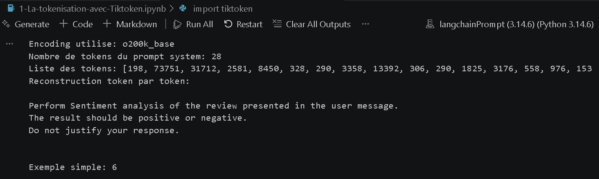

# Guide Complet : TP LangChain & Prompt Engineering (Master SDIA)

> Ce document sert de guide de référence pour configurer un environnement Python moderne et exécuter l'ensemble des exercices du TP sur l'ingénierie des prompts avec LangChain, Ollama, Groq et OpenAI. Ce guide prend en compte toutes les erreurs courantes (problèmes de PATH, erreurs de frappe dans les dépendances, limites de facturation API et modèles non supportés) et fournit les solutions exactes pour que chaque étape fonctionne du premier coup.

## Étape 1 : Prérequis Système

Avant de commencer, vous devez vous assurer que les outils de base sont correctement installés sur votre machine Windows.

1. **Python :** Téléchargez et installez la dernière version depuis [python.org](https://www.python.org/downloads/).

   > **⚠️ TRÈS IMPORTANT :** Lors de l'installation, n'oubliez pas de cocher la case **"Add python.exe to PATH"** en bas de l'écran d'installation. Sans cela, votre terminal ne reconnaîtra pas les commandes Python.

2. **Ollama :** Téléchargez et installez Ollama depuis [ollama.com](https://ollama.com/) pour faire tourner les modèles locaux. Assurez-vous que l'application est lancée (l'icône doit apparaître dans la barre des tâches).

---

## Étape 2 : Configuration de l'environnement avec `uv`

`uv` est un gestionnaire de paquets ultra-rapide pour Python.

**1. Installer** `uv` **(PowerShell) :**

```powershell
powershell -ExecutionPolicy ByPass -c "irm [https://astral.sh/uv/install.ps1](https://astral.sh/uv/install.ps1) | iex"
```

Si vous obtenez une erreur indiquant que `uv` n'est pas reconnu après l'installation, fermez votre terminal et ouvrez-en un nouveau, ou exécutez la commande fournie par l'installateur pour mettre à jour votre PATH.

**2. Initialiser le projet et l'environnement virtuel :**

Placez-vous dans votre dossier de travail et exécutez :

```bash
uv init
uv venv
```

**3. Activer l'environnement virtuel :**

```bash
.venv\Scripts\activate
```

> **⚠️ TRÈS IMPORTANT :** Erreur de sécurité PowerShell : Si PowerShell bloque l'activation du script (erreur PSSecurityException), ouvrez un terminal PowerShell en tant qu'Administrateur et tapez : `Set-ExecutionPolicy -ExecutionPolicy RemoteSigned -Scope CurrentUser`

## Étape 3 : Configuration de Jupyter Notebook

La commande pour installer le noyau Jupyter est :

```bash
uv pip install ipykernel
```

Dans VS Code, créez un fichier prompt.ipynb. Cliquez sur "Select Kernel" en haut à droite &gt; Python Environments &gt; Sélectionnez votre environnement .venv (Python 3.12).

## Étape 4 : Installation

**Tiktoken**

```bash
uv pip install tiktoken
```

**Télécharger le modèle localement**

```bash
ollama pull llama3.2:3b
```

**Installation des paquets**

```bash
uv pip install langchain-ollama ipython
```

**Installation des dépendances**

```bash
uv pip install python-dotenv langchain-groq langchain-openai
```

**Configurer vos clés API :**

Créez un fichier nommé exactement `.env` à la racine de votre projet. Ajoutez vos clés :

> OPENAI_API_KEY=sk-proj-votre_cle_openai
>
> Groq_API_Key=gsk_votre_cle_groq

## Des Screenshots:

**Titoken Output:**

